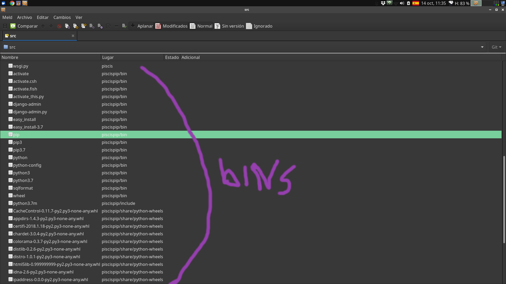

# Segunda entrega

- Fecha de entrega: Martes 22/10 23:59
- Subir al repo de github de cada proyecto. (yo lo clono y ejecuto los tests)

----

## Grispy

- Eliminar `clean()` de `test_io.py`
- Bueno los fixtures lo usan como `@fixture` o como `setup_method`. Lean la documentación para ver la diferencia. `SetUp` es del framework unittest no de pytest.
- Agreguen una info sobre la licencia a todos sus archivos *.py*.
  Algo como
  
  
  ```
    # This file is part of the
    #   Ajiaco Project (https://github.com/quatrope/ajiaco/).
    # Copyright (c) 2018-2019, Juan B Cabral
    # License: BSD-3-Clause
    #   Full Text: https://github.com/quatrope/ajiaco/blob/master/LICENSE
  ``` 

- Instalen *pydocstyle* en un environment de tox y ejecuten el comando:
  `pydocstyle grispy` en ese environment. Llamen a ese evironment tox **docstyle**. Eso lo que va a hacer es informarle sobre documentación faltante. No hay muchos errores.
- Borren los comentarios del tox.ini

----

## Piscis

- Desversionen todos los binarios que versionaros. 

  
  
- Los tests de los modelos siguen sin andar, no hacen nada.
- La licencia se pasa de la columna 80.
- Agreguen unas vistas como para ir mostrando el funcionamiento.
- Agreguen una info sobre la licencia a todos sus archivos *.py*.
  Algo como
  
  
  ```
    # This file is part of the
    #   Ajiaco Project (https://github.com/quatrope/ajiaco/).
    # Copyright (c) 2018-2019, Juan B Cabral
    # License: BSD-3-Clause
    #   Full Text: https://github.com/quatrope/ajiaco/blob/master/LICENSE
  ``` 
- Reordenen todo el proyecto django en un unico directorio. Fijense aca: https://github.com/carpyncho/web/tree/master/

- Ahora si agreguen un tox.ini que corra los tests y otro que corra flake8. Pueden copiar el de grispy aca y modificarlo: https://github.com/mchalela/GriSPy/blob/master/tox.ini
- No agregaron un userprofile a los modelos. Fijense en esto: https://github.com/carpyncho/web/blob/master/project/carpyncho/navigator/models.py#L65-L80 estan resaltadas las lineas a prestarle atención.

### Finalmente:

Lean https://es.wikipedia.org/wiki/Par%C3%A1lisis_del_an%C3%A1lisis

El orden de las cosas que tienen que hacer es:

1. Primero los tests
2. Tox
3. Dividir tareas y trabajar en paralelo. Si tox falla estas haciendo algo mal. 
