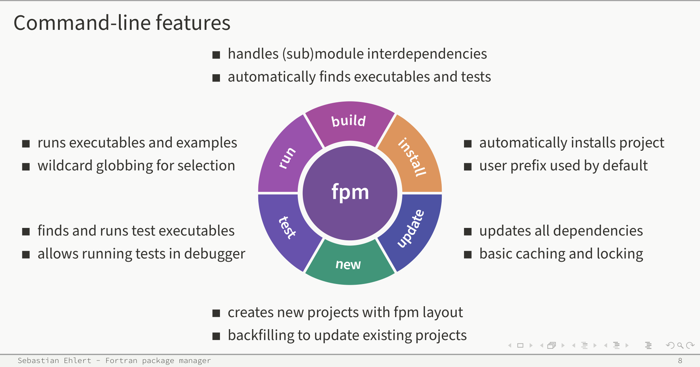
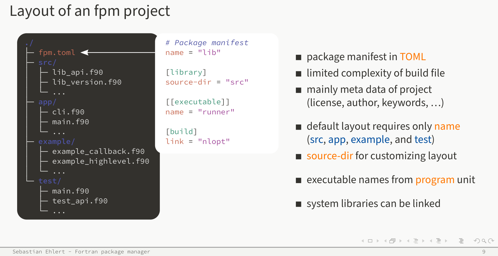
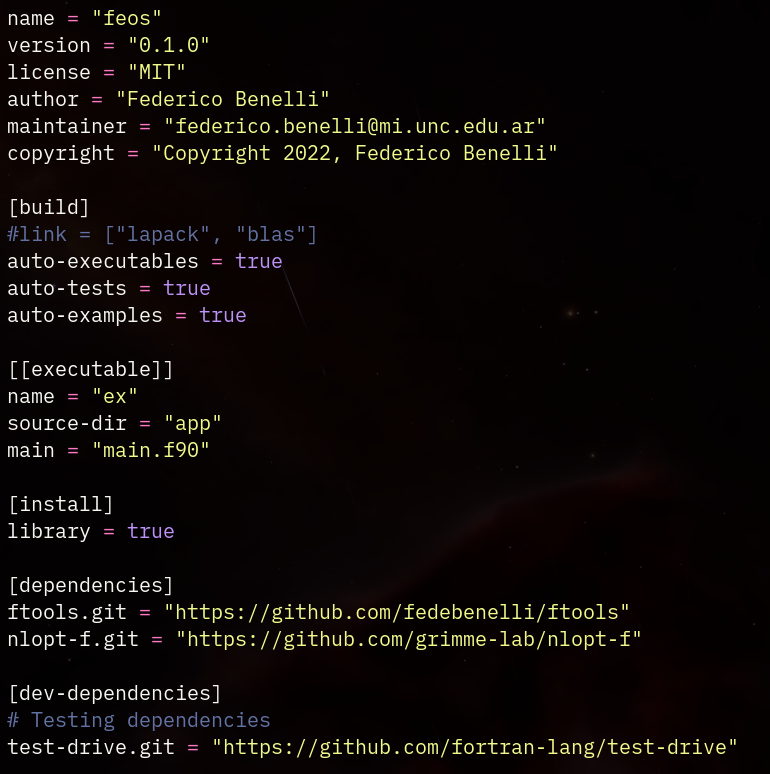
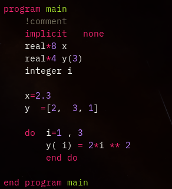
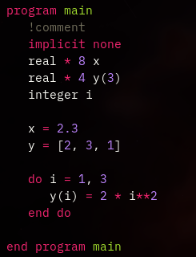

# Empaquetamiento

### Contenido

- Compilación.
- Makefiles.
- fpm.

## Compilación

### Compilación: Pasos básicos

Fortran es un lenguaje compilado.

```bash
# Compilación básica
gfortran source.f90 -o main
```

### Compilación: Flags importantes

\small
```
-Wall -Wextra           ; Muchas warnings
-fcheck=all             ; checks durante runtime
-ON (N=0, 1, 2, 3, fast); grado de optimización
-funroll-loops          ; "desarmar" los loops
-fimplicit-none         ; forzar implicit none
-fdefault-real-8        ;
-freal-4-real-8         ;
```
\normalsize

\tiny
[https://gcc.gnu.org/onlinedocs/gfortran/Fortran-Dialect-Options.html](https://gcc.gnu.org/onlinedocs/gfortran/Fortran-Dialect-Options.html)
[https://gcc.gnu.org/onlinedocs/gfortran/Code-Gen-Options.html](https://gcc.gnu.org/onlinedocs/gfortran/Code-Gen-Options.html)
\normalsize

### Makefiles.
Una forma de simplificar el proceso de compilación es mediante
un Makefile.

- Forma estructurada de definir dependencias.
- Automatización de comandos.
- Cambiar el proceso de compilación con variables.

### Makefiles: Ejemplo básico

- Ejemplo: `makefiles` dir

Algo mejor:

\tiny
> [https://aoterodelaroza.github.io/devnotes/modern-fortran-makefiles/](https://aoterodelaroza.github.io/devnotes/modern-fortran-makefiles/)
\normalsize


## fpm

### fpm: Fortran Package Manager

Gestor de paquetes desarrollado por fortran-lang, basado en el gestor cargo
de Rust.

[https://fpm.fortran-lang.org/](https://fpm.fortran-lang.org/)

### fpm: Funcionamiento


Fuente: [https://tcevents.chem.uzh.ch/event/14/contributions/68/](https://tcevents.chem.uzh.ch/event/14/contributions/68/)

### fpm: Estructura de archivos



### fpm: Configuración

::: columns

::: column

Un paquete de Fortran distribuido mediante fpm se configura mediante un archivo
`fpm.toml`

Contiene

- Metadata del proyecto
- Dependencias (separando dependencias de desarrollo de release)
- Librerías de sistema que se utilizan

:::

::: column



:::

:::

# Calidad

## Análisis estático
### Análisis estático: Linters

- fprettify.
- flinter.
- fortran-linter.

Un set de guidelines de estilo:

[https://flinter.readthedocs.io/en/latest/fortran_guidelines.html](https://flinter.readthedocs.io/en/latest/fortran_guidelines.html)

### Linters: fprettify

- No es un linter, es un formateador
- Solo hace tres cosas (que es más o menos lo mismo)
    - Alinea indentaciones.
    - Acomoda whitespace entre operadores.
    - Trata de limitar el ancho de filas. Tira un warning si no puede

```bash
fprettify --whitespace 4 -l 80 file.f90
```

{height=40%}\ {height=40%}

### Linters: fortran-linter
Este si es un linter.

- Sigue siendo más limitado que `flake8` 
- Tira un set de warnings y también tiene la posibilidad de modificar el código

\tiny
```bash
# Mostrar que tan mal estamos
fortran-linter --syntax-only --line-length 80 file.f90
# Modificar el archivo
fortran-linter --line-length 80 --inplace file.f90
```
\normalsize

Si se modifica el archivo se genera un backup `file.f90.orig`

### Linters: flinter
Por último, también está `flinter`

- Es un poco más avanzado.
- Tiene un archivo de configuración para las regex.
- Le da un puntaje al código.

```bash
pip install flinter
flint lint file.f90
flint lint folder
flint tree folder #> Está bueno para saber donde atacar con más prioridad
```

## Testing
### Testing
Existen varios frameworks de testing:

- FUnit
- veggies
- test-drive

Yo uso test-drive así que vamos a ver ese.

### Testing: test-drive

Los tests se separan en módulos que luego se colectan desde un runner
principal.

- Puede agregarse como una dependencia en `fpm`.
- Es un único archivo que también puede agregarse a la fuente.

### test-drive: test

\tiny
```fortran
subroutine test_cosa(error)
  type(error_type), allocatable, intent(out) :: error

  call check(error, 1 + 2 == 3)
  if (allocated(error)) return

  ! equivalent to the above
  call check(error, 1 + 2, 3)
  if (allocated(error)) return
end subroutine test_cosa
```
\normalsize

### test-drive: collector de tests

\tiny
```fortran
!> Collect all exported unit tests
subroutine collect_suite(testsuite)
  !> Collection of tests
  type(unittest_type), allocatable, intent(out) :: testsuite(:)

  testsuite = [ &
    new_unittest("valid", test_valid), &
    new_unittest("invalid", test_invalid, should_fail=.true.) &
    ]

end subroutine collect_suite
```
\normalsize

### test-drive: runner

\tiny
```fortran
program tester
  ...
  use test_suite, only : collect_suite
  ...
  type(testsuite_type), allocatable :: testsuites(:)

  stat = 0

  testsuites = [ &
    new_testsuite("suite1", collect_suite), &
    ...
    ]

  do is = 1, size(testsuites)
    write(error_unit, fmt) "Testing:", testsuites(is)%name
    call run_testsuite(testsuites(is)%collect, error_unit, stat)
  end do

  if (stat > 0) then
    write(error_unit, '(i0, 1x, a)') stat, "test(s) failed!"
    error stop
  end if

end program tester
```
\normalsize


## Coverage

### Coverage
Se pueden generar archivos de coverage compilando con la flag `--coverage`
(usando `gfortran`).

- Con `fpm` simplemente es necesario correr:

> `fpm test --flag "--coverage"`

- `gcovr`: Es un paquete en python que warpea la herramienta `gcov` y brinda
una funcionalidad similar a `coverage.py` 

    - Importante aclararle de donde no incluir coverage.

\tiny
```bash
gcovr --exclude "build" \
      --exclude "example" \
      --exclude "app" --fail-under-branch 90
```
\normalsize

## Documentación
### Documentación: Ford
La generación de documentación se puede hacer mediante `Ford`

Genera automáticamente un html a partir del código.

También permite agregar páginas estáticas, ya sean html o markdown.

### Ford: Archivo de configuración
`Ford` se maneja con un único archivo de configuración donde se especifican los
detalles de qué documentar y cómo.

- Ejemplo: `feos`

## Otras cosas
Existen varias herramientas para mejorar Fortran en mal estado. No se puede
llegar a evaluarlas dentro del scope del curso (ni yo llegué a usarlas), pero
dejo el link a una compilación por si es de utilidad para alguien:


\small
- Roquefort: transforma bloques `common` a módulos y solo importa
variables/rutinas que se usan
  - [https://github.com/NLESC-JCER/roquefort](https://github.com/NLESC-JCER/roquefort)

- f90wrap: Genera wrappers para objetos que no son compatibles con f2py (lo que sigue)
  - [https://github.com/jameskermode/f90wrap](https://github.com/jameskermode/f90wrap)

Más herramietnas:

- [https://github.com/Beliavsky/Fortran-Tools#refactoring](https://github.com/Beliavsky/Fortran-Tools#refactoring)
\normalsize

# Interfaces con otros lenguajes

## C

\tiny
A partir de Fortran 2003 se puede correr código Fortran desde C (y viceversa)

#### Fortran
```fortran
!function.f09
subroutine f(x, y) bind(C, name="f_fortran")
    use iso_c_binding, only: c_double
    real(c_double), intent(in) :: x
    real(c_double), intent(out) :: y
    y = x**2
end subroutine f
```

#### C
```C
// cside.c
#include <stdio.h>
extern double f_fortran(double [], double []);
main()
{
    double x=2.0; double y=5.0; double z;
    z = f_fortran(&x, &y); 
    printf("x: %f, y: %f, z: %f",
            x, y, z);
}
```

\Tiny
#### Compilación
```bash
gfortran -c function.f90
gcc -o exec cside.c function.f90
```
\normalsize

## Python

### f2py

El principal método de interfacear Fortran con Python es mediante `f2py`

\tiny
- Genera módulos de extensión (extension modules) para Python a partir de código Fortran.
- Utilizar subrutinas, datos en bloques COMMON y variables en módulos de FORTRAN 77 o Fortran 90/95 desde Python.
- Llamar funciones de Python desde Fortran (callbacks).
- Manejar automáticamente la diferencia entre arrays NumPy-contiguos (esto es, C-contiguos) y Fortran-contiguos.
- Fue creado en 1999 por Pearu Peterson mientras era estudiante de doctorado en la Universidad Técnica de Tallin, y en 2005 después de varias versiones estables quedó incluido dentro de NumPy.
\normalsize

### f2py: Instalación

- Viene instalado con numpy, así que no hace falta nada
- Hace falta tener instalado un compilador de fortran (preferentemente `gfortran`)

#### Uso
Se puede usar desde la terminal como:

```bash
f2py -c -m modulo_python archivo_fortran.f90
```

### f2py: Lo malo

#### Incompatibilidad
f2py está limitado a las características básicas de Fortran. Objetos (types)
no funcionan. 

\hrule

\tiny
```fortran
subroutine sub_noanda(x, y)
  type(mi_objeto) :: x
  real :: y
  !cosas
end subroutine
```
\normalsize

#### Solución

Hacer subroutinas/funciones wrappers que tomen la información básica

### f2py: lo malo

\tiny
```fortran
subroutine sub_noanda(x, y)
  type(mi_objeto), intent(in) :: x
  real, intent(out) :: y
  !cosas
end subroutine
```
\normalsize

\tiny
```fortran
subroutine sub_estasi(n, x, y)
  integer :: n
  real, intent(in) :: x(n)
  real, intent(out) :: y
  
  type(mi_objeto) :: in_obj

  in_obj%x = x
  call sub_noanda(in_obj, y)
end subroutine
```
\normalsize

\

\Tiny

> Si el código ya es extremadamente complicado lo mejor es armar un par de
> procedimientos que llamen a lo importante y solo se trabaje con eso,
> compilando previamente el código principal como una librería.

\normalsize


### f2py: Packaging
Muy lindo compilarlo desde la terminal, pero y para automatizarlo en un paquete?

Es necesario utilizar CMake.

- Ejemplo gchop.
- Ejemplo pff.
